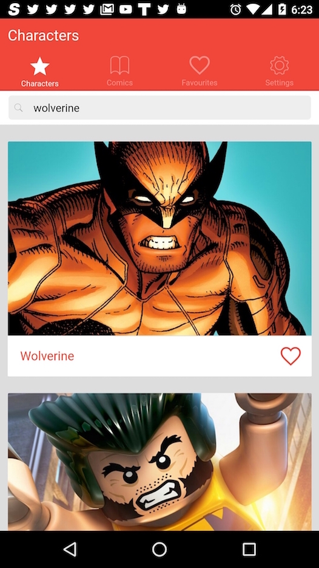
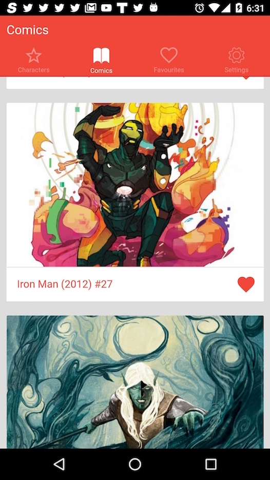
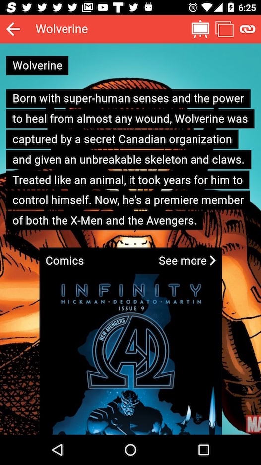
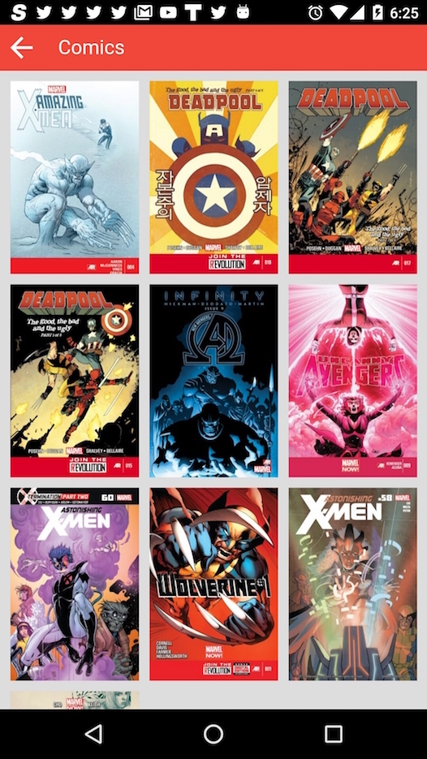
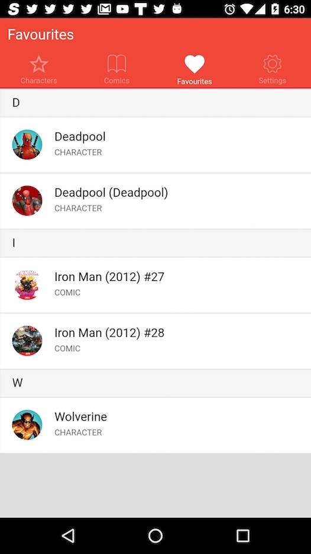
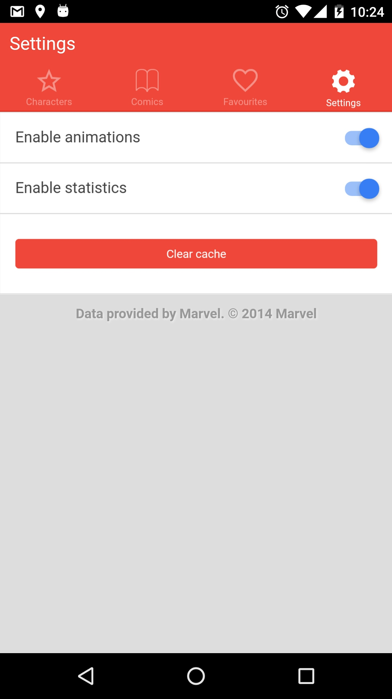

[](https://travis-ci.org/jdat82/learning-ionic)
[](https://gemnasium.com/github.com/jdat82/learning-ionic)
[](https://codecov.io/gh/jdat82/learning-ionic)

[//]: # ([](http://inch-ci.org/github/jdat82/learning-ionic))

<!-- START doctoc generated TOC please keep comment here to allow auto update -->
<!-- DON'T EDIT THIS SECTION, INSTEAD RE-RUN doctoc TO UPDATE -->


- [Overview](#overview)
- [Illustrations](#illustrations)
- [Features](#features)
- [Prerequisites](#prerequisites)
- [Conventions](#conventions)
  - [Build](#build)
  - [Javascript](#javascript)
    - [General](#general)
    - [Angular](#angular)
  - [CSS](#css)
    - [SASS](#sass)
    - [Classes](#classes)
- [Run](#run)
  - [In case you don't know](#in-case-you-dont-know)
  - [npm run serve](#npm-run-serve)
  - [npm run android](#npm-run-android)
  - [npm run android-lr](#npm-run-android-lr)
  - [npm run ios](#npm-run-ios)
  - [npm run ios-lr](#npm-run-ios-lr)
  - [npm test](#npm-test)
  - [npm run wtest](#npm-run-wtest)
  - [npm run doc](#npm-run-doc)
  - [npm run build [-- \<platform>]](#npm-run-build----%5Cplatform)
- [Build](#build-1)
  - [Options](#options)
    - [--proxy | --no-proxy](#--proxy----no-proxy)
    - [--mock | --no-mock](#--mock----no-mock)
    - [--patterns <name>](#--patterns-name)
    - [--platform <name>](#--platform-name)
- [Serving changes](#serving-changes)
  - [In your browser](#in-your-browser)
  - [On device](#on-device)
    - [Without livereload support](#without-livereload-support)
    - [With livereload support](#with-livereload-support)
- [Tests](#tests)
  - [Unit tests](#unit-tests)
- [Documentation](#documentation)
- [Error handling](#error-handling)
  - [Err class](#err-class)
  - [Default angular handler](#default-angular-handler)
- [Splashscreen reflexions](#splashscreen-reflexions)
- [Known bugs](#known-bugs)
- [Release process](#release-process)

<!-- END doctoc generated TOC please keep comment here to allow auto update -->

# Overview

This is a demo app to apprehend IONIC which is built upon Cordova and Firebase.

Scope : iOS 8+ / Android 4.4+

I will not develop new UI functionalities. It is a simple demo. In a normal app, some UI choices would have been different but I wanted to illustrate some components and keep it simple.
Detail screens are poor in informations by necessity because the Marvel API is very limited. You have to go to the official site in order to view more detailed infos.

Quick readers can do `npm start` in order to :

- Install node dependencies
- Install javascript dependencies
- Build project
- Launch a web server with reverse proxy and livereload
- Open app in default browser

Nonetheless I do not recommend to develop with your browser. It is different than a real device. You should develop on a real device and use the browser solution when it makes sense to make your life simpler for particular cases.

In order to test in a simulator/emulator/device, you will need first to install everything needed by cordova and ionic (sdk, emulators, etc.) and then hit `ionic state restore` in your terminal which will install all cordova platforms and plugins. See prerequisites (next section).

Then you just need to use one of the predefined npm alias. For instance: `npm run android` in order to :

- Build project
- Deploy on a real device if connected or an emulator/simulator as fallback

[Crosswalk](https://www.npmjs.com/package/cordova-plugin-crosswalk-webview) is used as the default android browser, thus allowing us to share the same engine for all platforms. It give us control on that engine. We can update it whenever we want and have always the latest innovations from Chromium. The downside is a 25mb overload to the apk size.

On iOS land, [WkWebView](https://www.npmjs.com/package/cordova-plugin-wkwebview-engine) is not used yet because it is too young.

# Illustrations










# Features

- Search for characters whose name starts with…
- Search for comics whose title starts with…
- Show character/comic infos (very limited by design by Marvel)
- Preview character/comic illustration with zoom and sharing capabilities
- Open in default browser the character/comic official page on marvel.com
- Show comics related to a character in an infinite list
- Save favourites (comic or character) via Firebase Database and Firebase Auth (anonymous auth only)
- JSON responses are cached on disk for one week
- Images are cached on disk
- Go up to the top in search lists by clicking the title
- Settings : 
  - empty responses and images caches
  - Disable animations for less capable devices
  - Disable google analytics
- Travis CI : web build & unit tests (javascript)
- Greenhouse CI : native build & unit tests (javascript) & Crashlytics Beta deployment

# Prerequisites

Cordova, Ionic, Bower and Grunt should be installed globally, they will delegate to a local instance if any :
```bash
npm i -g cordova ionic bower grunt-cli
```

iOS deployment tools should also be installed globally as recommended by Ionic for practical reasons too :
```bash
npm i -g ios-sim ios-deploy
```

XCode should be installed from the Mac App Store and launched at least once.

Android Studio and sdk should be installed. Android tools should be in path.
You may install and configure emulator images if you want to run this project in an emulator.

JDK 7 (or more recent) should be installed.

This project should work on all versions of node since 0.12.7. I recommend [NVM](https://github.com/creationix/nvm) for simple and powerful node management.

# Conventions

## Build

This project uses [Grunt](http://gruntjs.com/) as a task manager. Grunt tasks are lazy-loaded for performance.
Tasks are defined inside `grunt` folder. There is one file per type of task. For instance, `css.js` contains css related tasks. It allows to have all related tasks in one file without having a too bigger file. I found it to be a good compromise between a one-file-per-task and and a one-big-monolithic-file strategies.

Grunt is used essentially to build web code and start tools.

## Javascript

### General

This project is using jshint and jscs to validate both form and content.

### Angular

This project tries to respect [guidelines from Angular team](https://github.com/johnpapa/angular-styleguide).

Don't forget to use super easy optimisations like [one-time binding](https://code.angularjs.org/1.4.8/docs/guide/expression) and [track-by expressions](https://code.angularjs.org/1.4.8/docs/api/ng/directive/ngRepeat).

## CSS

### SASS

`_ionic.app.scss` is reserved for ionic customization like when we want to override default colors, or default font sizes, etc.

`_layout.scss` should contain transverse layout definitions.

`app.scss` is our entry point. You probably will never have to modify it. It is responsible to import everything else.

When writing a new scss file for a component you should always prefix it with `_` so we know it is a partial. This is convention in sass world. All partials are automatically imported by `app.scss` when building. See `grunt/css.js`.

### Classes

I always liked css object oriented features but they come with the cost of performance and maintainability.
I would like to try a [BEM custom approach](http://csswizardry.com/2013/01/mindbemding-getting-your-head-round-bem-syntax/) which seems to be a good compromise :

- better performance because there is less levels of imbrication
- better maintainability and readability
- less regressions and complications when working with other developers

# Run

The file `package.json` contains a list of useful alias that you can invoke with `npm run <alias>`.

## In case you don't know

Ionic comes with some very useful tools. Essentially it allows three differents way to test and deploy your code :

- Start a web server with optional proxy support and then deploy in a browser
  - which means your code is served via a web server loaded from `http://localhost:8100`
- Deploy in a real device (or a simulator/emulator if none)
  - which means your code is copied on device and loaded from a `file://` url
- Deploy in a real device (or a simulator/emulator if none) in livereload mode
  - which means your code is served via a web server
  - your code is loaded from `http://<ip>:8100` even though your are on a real device

> WARNING: if I'm not mistaken, ionic built-in proxy is not working behind a corporate proxy.
> For myself, I'm working either on wifi or on a local network made with my mobile.


## npm run serve

- Build project with cordova mocks and proxy support
- Serve the app in default browser

You may pass a `--lab` option as it will delegate to `ionic serve` internally:
```bash
npm run serve -- --lab
```

## npm run android

- Build web code
- Build native code 
- Deploy to android device (emulator if none)

## npm run android-lr

- Build web code with proxy support
- Build native code
- Start a watcher for web code
- Start a web server with proxy
- Deploy to android device (emulator if none) with livereload support

## npm run ios

- Build web code 
- Build native code 
- Deploy to ios device (simulator if none)

## npm run ios-lr

- Build web project with proxy support
- Build native code 
- Start a watcher for web code
- Start a web server with proxy
- Deploy to ios device (simulator if none) with livereload support

## npm test

- Build web project with cordova mocks support
- Execute unit tests with karma in a PhantomJS container
- Generate JUnit and Coverage reporters

## npm run wtest

- Build web project with cordova mocks support
- Start a watcher for web code
- Execute unit tests with karma in a Chrome container with auto-watch enabled and no reporters
  - it means changes to code or tests are taken into account live

## npm run doc

- Generate [groc](https://github.com/nevir/groc) and [plato](https://github.com/es-analysis/plato) documentation.

## npm run build [-- \<platform>]

If you simply want to build code without mocks/proxy/livereload options.

- Build web code
- Build native code

# Build

Project is built inside `www`.

Just hit `grunt dev` to build the whole project for development.

To reduce build time, you can use `grunt` or `grunt newdev` to build only what changed since last build.

`grunt dist` will build with distribution options.

## Options

### --proxy | --no-proxy

Instrument `conf/dev.js`: change API endpoint and enable the livereload option in order to leverage a reverse proxy on the local machine.

Make sense for these commands :

- `npm run serve`
- `npm run <platform>-lr`

### --mock | --no-mock

Instrument `conf/dev.js`: enable ngCordova mocks.

Make sense for this command :

- `npm run serve`

### --patterns <name>

Define which file from `conf/` will be used as source of patterns. These patterns will be used to make replacements in source files.
See [grunt-replace](https://github.com/outaTiME/grunt-replace).

For instance: `grunt dev --patterns foo` would use `conf/foo.js`.

Can be use with any command.

### --platform <name>

Define which platform is currently built. May be useful if you want to do something for a specific platform like adding or removing a library… 

For instance: `grunt dev --platform windows`

Can be use with any command. 

# Serving changes

> WARNING: if I'm not mistaken, ionic built-in proxy is not working behind a corporate proxy.

## In your browser

To build, launch a local web server and watch for changes:
```bash
npm run serve
```

You may pass a `--lab` option as it will delegate to `ionic serve` internally:
```bash
npm run serve -- --lab
```

Code is loaded from `http://localhost:8100`.

## On device

To build and deploy on device (or simulator if any):
```bash
npm run <platform>
```

### Without livereload support

Allowed `platform` values:

- android
- ios

Code is loaded from `file://assets/index.html`.

### With livereload support

You may use instead:

- android-lr
- ios-lr

It will also start a watcher for code changes and the built-in ionic web server in livereload mode.

Code is loaded from `http://<your ip>:8100`.

See npm scripts in `package.json` and [IONIC CLI](http://ionicframework.com/docs/cli/test.html) to have a better understanding.

# Tests

## Unit tests

To launch unit tests : `npm run test` ou `npm test`.

To launch unit tests and watch for changes : `npm run wtest`.

Unit tests are run by Karma and written with Jasmine:

- JUnit reports are generated inside `doc/test/junit`
- Coverage reports are generated with Istanbul inside `doc/test/coverage`

# Documentation

To generate groc and plato documentation inside `doc` folder: `npm run doc`.

# Error handling

## Err class

Error codes should be defined in `err.factory.js`. 

`Err` is a class that inherits the standard javascript `Error` class in order to add new attributes like `code`. 
Its message is automatically defined based on its code but it is possible to override that message. You may also give it a cause.

To create a new error, you can do:
```javascript
// if 1000 is an an existing error code, its message will be found automatically.
if(condition) throw new Err(1000);   
    
// You can also pass options like a source error or a specific hardcoded message.
throw new Err(1000, {source: err, message: 'my hardcoded message'});

// You may also set the `ui` flag to true in order to inform the default handler it can safely print that error to the user.
throw new Err(1000, {ui:true});
```

## Default angular handler

`$exceptionHandler` was decorated to show a toast in last resort.

**Concerning chains of promises, you should follow some rules:**

- the one ending a chain of promises is responsible in case of rejection to throw an exception if pertinent in order to trigger `$exceptionHandler`. 
Indeed, in `$q` angular implementation, contrary to `Q` there is no `done` function to catch uncaught rejected promises.  

- the one throwing an exception should throw an instance of `Err` with at least a code. 

- In order to buy time and code less, you might want to reuse `throwErr` injectable function.

```javascript
return countryLanguageService.allCountries().then(function (response) {
	vm.countries = response.data;
}).catch(showErr); 

////////

function showErr(err){
    if( I can handle that error) do something
    else throwErr(err);
}
```

To resume, if you do not have any error handling in your code because, for instance, you do not have to manage any specific error code for your case, you should at least use `throwErr` so generic errors are being handled by $exceptionHandler`.

```javascript
return countryLanguageService.allCountries().then(function (response) {
	vm.countries = response.data;
}).catch(throwErr); // throwErr is injectable via DI
```

# Splashscreen reflexions

I do not recommend to auto hide the splashscreen. Depending on your device velocity the splashscreen may hide itself before the webview is visible. This is what happens on Android:

1. Black screen (which is your app's background)
1. Show Splashscreen then hide after delay
1. Reveal what is behind, so depending on device, it may be :

- still a black screen
- your webview

Augmenting the delay may be a solution if you didn't set preference `SplashShowOnlyFirstTime` to false. It is not very pretty though.
 
I recommend to either hide the splashscreen yourself when you are ready* (more on that later) or use a very basic native splashscreen (one color) and then a web splashscreen. A web splashscreen allows much more flexibility and creativity but is more expensive.

> Warning: [the plugin splashscreen is broken in version 3.0.0 and 3.1.0](https://issues.apache.org/jira/browse/CB-10412?jql=project%20%3D%20CB%20AND%20status%20in%20(Open%2C%20%22In%20Progress%22%2C%20Reopened)%20AND%20resolution%20%3D%20Unresolved%20AND%20component%20%3D%20%22Plugin%20Splashscreen%22%20AND%20text%20~%20%22hide%22%20ORDER%20BY%20priority%20DESC%2C%20summary%20ASC%2C%20updatedDate%20DESC): you can't hide the splashscreen yourself.

I don't know a cordova way to customize the app's default background, but by modifying the code of each shell and defining a custom background color in adequation with your look it can be even prettier. I don't like modifying native code though.
 
# Known bugs
 
- Images in cache (`file://` urls) does not load the first time for a security reason when deploying in live reload mode (`http://`)
- Random crash in lists caused by duplicate IDs in the Marvel database
 
# Release process

```bash
# 1. Modify package.json and config.xml
grunt bump-only[:<version>]
# 2. Generate changelog
grunt conventionalChangelog
# 3. Commit, create tag and push to origin (including tags)
grunt commit-only
```